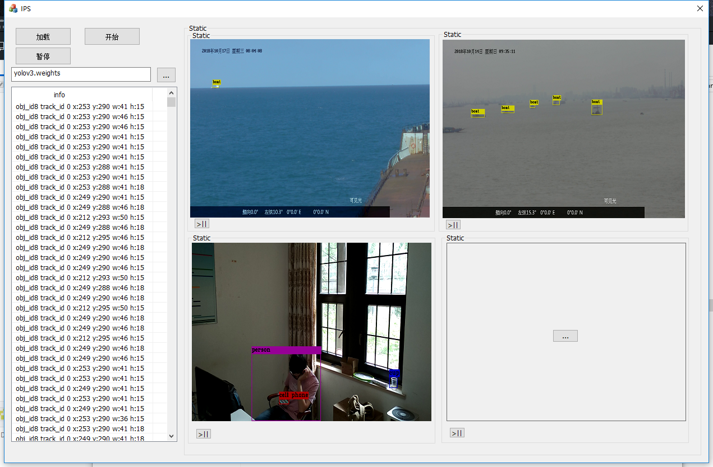

# IPS
用MFC来显示实现图像识别画面显示，主要是便于后期项目中测试。
功能包括显示目标检测后的图像。
可同时播放四路视频，图像来源包括本地视频，网络视频，和本地图片。
具备基本的播放器的开始，暂停空能。同一个播放窗口可随时切换视频和图片。
第一次初始化时需要加载weights及神经网络net，比较慢，随后再次加载视频和图片时会很流畅
左侧显示目标bbox信息
图像视频切割，图像标记等

    

